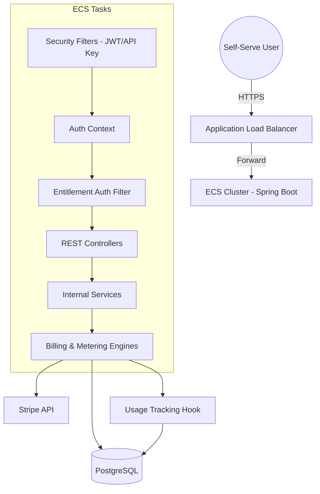
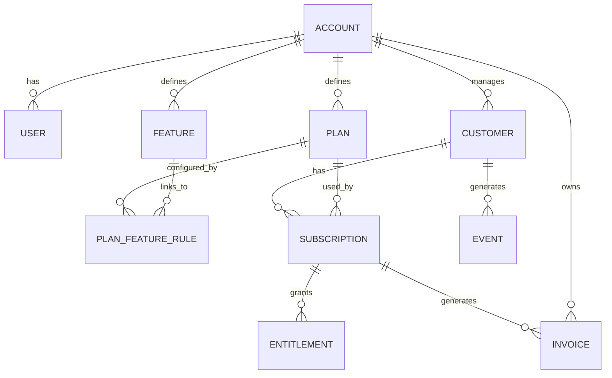

# Claude Context: Tanso Core - Comprehensive Technical Guide

This document is a deep-dive technical reference for the Tanso Core project. It is designed to provide maximum context for AI assistants, ensuring a clear understanding of the architecture, monetization engine, and "dogfooding" implementation.

---

## 1. Project Mission & Core Responsibilities
Tanso Core is a B2B SaaS monetization engine that powers the "Tanso" ecosystem. Its primary goal is to provide a robust, scalable, and flexible infrastructure for managing customer lifecycles, complex billing models, and real-time feature entitlements.

### Core Domains:
1.  **Identity & Workspace**: Management of `Accounts` (Tenants), `Users`, and their associations.
2.  **Product Catalog**: Defining `Features` and grouping them into `Plans`.
3.  **Monetization Rules**: Linking features to plans with complex logic (Flat, Usage-based, Graduated).
4.  **Subscription Management**: Orchestrating the lifecycle of a `Customer` on a `Plan`.
5.  **Usage & Metering**: High-throughput `Event` ingestion and real-time usage tracking.
6.  **Entitlements**: Dynamic, low-latency gating of capabilities based on subscription state.
7.  **Billing & Payments**: Invoice generation, cycle management, and Stripe synchronization.

---

## 2. Component Architecture & Client Interfaces

Tanso is a Spring Boot application deployed on AWS ECS behind an Application Load Balancer (ALB).

### A. High-Level Component Diagram (Mermaid)

### B. Client API (`/api/v1/client/**`)
Designed for external integration and developer experience.
*   **Authentication**: Supports `Authorization: Bearer <API_KEY>` or `X-API-Key: <API_KEY>`.
*   **Key Endpoints**:
    *   `POST /events`: Ingest usage data (idempotent via `eventIdempotencyKey`).
    *   `GET /entitlements/{refId}/{key}`: Low-latency check for feature access.
    *   `POST /subscriptions`: Self-serve plan enrollment.

### C. Tanso Admin & UI API (`/api/v1/monetization/**`)
Powers the Tanso Dashboard (Retool/Internal UI) for managing the platform.
*   **Authentication**: Requires JWT with `ROLE_TANSO_UI`.
*   **Key Endpoints**:
    *   `GET /plans/features`: View the complete product catalog.
    *   `PATCH /rules/plan-features/diff/{id}`: Batch update feature rules for a plan.

### D. Security & Role Model

| Role | Access Pattern | Target Endpoints |
| :--- | :--- | :--- |
| **`ROLE_TANSO_UI`** | Tanso Dashboard Admins | `/api/v1/monetization/**`, `/api/v1/tanso/**` |
| **`ROLE_CLIENT`** | External Developers / API | `/api/v1/client/**` |
| **Public** | Signup, Login, Webhooks | `/public/**` |

*   **JWT**: Short-lived tokens for UI sessions. Generated via `JwtService`.
*   **API Key**: Long-lived keys (`sk_live_...`) for server-to-server integration. Handled by `ApiKeyAuthFilter`.

### E. Configuration & Environment Flags

| Property | Default | Description |
| :--- | :--- | :--- |
| `app.dogfooding-enabled` | `true` | When `false`, skips Tanso Platform entitlement checks and usage tracking. Useful for local dev. |

---

## 3. Internal "Dogfooding" Architecture

Tanso bills itself using its own core logic. This "Double-Account" pattern is the most critical concept for understanding the platform's self-serve implementation.

### A. The "Double-Account" Mechanism
Tanso operates as a **Provider** to its own **Client Organizations**.
*   **Master Account**: A hardcoded entity (UUID: `00000000-0000-0000-0000-000000000000`) named "Tanso Platform".
*   **Client Organizations**: Every self-serve account created via signup is registered as a `Customer` of the Master Account.
*   **Logical Mapping**: 
    *   `MasterAccount.id` -> The Provider.
    *   `ClientAccount.id` -> Stored as `Customer.externalClientCustomerId` under the Master Account.

### B. Dogfooding Logic Flows

#### 1. Automated Onboarding (`POST /public/v1/signup`)
Executed by `OnboardingService`:
1.  `AccountService.createAccount`: Provisions the new client workspace.
2.  `UserService.createUser`: Provisions the admin user.
3.  `UsersAccountRepository.save`: Links User to Account with `ADMIN` role.
4.  **The Dogfood Switch**: Temporarily elevates context to `Master Account` to call `CustomerService.createCustomer`, registering the client `accountId` as a billing entity.

#### 2. Real-time Feature Gating
Handled by `EntitlementAuthFilter`:
1.  Intercepts `/api/v1/**` (Dashboard) requests.
2.  Extracts `accountId` from JWT.
3.  Calls `ClientEntitlementService.checkEntitlement` against the **Master Account**.
4.  If `isAllowed: true`, the request proceeds. Otherwise, returns `403 Forbidden`.

#### 3. Usage Metering Hook
Inside `EventServiceImpl.createEvent`:
1.  Processes the client's event.
2.  Check: `if (accountId != MasterAccount && eventType != ENTITLEMENT_CHECKED)`.
3.  **Recursion Prevention**: Ensures we don't meter the Master Account or the metering events themselves.
4.  Track: Calls `checkAndTrackEntitlement` for the Master Account, recording the client's platform usage.

### C. Why it exists:
1.  **Uniformity**: We use the same `/api/v1/client/**` APIs that our customers use.
2.  **Feedback Loop**: Any performance issue or bug in our billing affects us first.
3.  **Isolation**: Master revenue data is logically partitioned from client business data via the `accountId` foreign key.

---

## 4. Entity Relationship Deep Dive

### A. Core Hierarchy

### B. Monetization Details
1.  **Feature**: A single capability (e.g., `feature_api_access`). Feature keys are globally unique per account.
2.  **Plan**: A product bundle (e.g., `Pro Tier`). Contains metadata like `priceAmount`, `intervalMonths`, and `billingTiming` (IN_ADVANCE vs IN_ARREARS).
3.  **PlanFeatureRule**: The "Glue" that defines how a feature behaves in a plan.
    *   `value` (JSONB): Contains the `PricingModel` and `CostModel`.
    *   `PricingModel`: Defines how we bill the customer (e.g., `usage` for flat rate, `graduated` for tiers).
    *   `CostModel`: Defines our internal cost for providing the feature (e.g., `simple` per-unit cost).

### C. Billing & Usage
1.  **Subscription**: Links a `Customer` to a `Plan`. Manages `current_period_start/end`, `billing_anchor_day`, and `cancel_mode`.
2.  **Entitlement**: The materialized "right to use" a feature for a specific subscription. These are transient records that the `EntitlementService` manages based on active subscriptions.
3.  **Event**: A record of activity. 
    *   `CLIENT_TRACKED`: Standard usage event (e.g., "AI Message Sent").
    *   `ENTITLEMENT_CHECKED`: Metadata event recorded for billing audit trails.
4.  **Invoice**: Generated at cycle end. Orchestrates payment via Stripe. Statuses: `PENDING`, `DUE`, `PAID`, `VOID`.

---

## 5. Critical Logic Flows

### A. Billing Cycle Rollover
Managed by `SubscriptionCycleJob` and `InvoiceService`:
1.  Identifies subscriptions where `currentPeriodEnd <= now`.
2.  Aggregates usage events for the period.
3.  Applies `RuleCalculationUtil` to determine costs based on `GraduatedPricingModel`.
4.  Creates a `DUE` invoice.
5.  Syncs with Stripe via `StripeSyncService`.

---

## 6. Service & Utility Deep Dive

### A. `RuleCalculationUtil`
This utility is the heart of the pricing engine. It deserializes the `PlanFeatureRule.value` into concrete models:
*   **Pricing**: Supports `SimpleUsageModel` (flat) and `GraduatedPricingModel` (tiered).
*   **Cost**: Supports `SimpleCostModel` for internal margin analysis.
*   **Logic**: `calculateActualCost` uses these models to turn raw usage units into currency amounts.

### B. `SubscriptionServiceImpl`
Manages state transitions:
*   `subscribe`: Initializes periods, generates the first invoice, and triggers entitlement granting.
*   `upgradeSubscription`: Handles immediate upgrades with proration calculation based on time remaining in the current period.
*   `cancelSubscription`: Supports `IMMEDIATE` (kill now) or `END_OF_PERIOD` (keep active until next cycle).

### C. `InvoiceServiceImpl`
Handles complex aggregation:
*   `calculateUsageItems`: Queries the `EventService` for all events belonging to a customer/feature within the billing window.
*   `processPendingInvoices`: Moves invoices from `PENDING` to `DUE` and triggers Stripe synchronization.

---

## 7. Development Guidelines for AI

### 1. Data Isolation is Paramount
Every query must be scoped by `accountId`. Never trust a raw UUID from a request body without verifying ownership via the `UserContext`.

### 2. The "Recursion Guard"
When modifying `EventService` or `EntitlementService`, always verify that you aren't creating a loop. Metering events (`ENTITLEMENT_CHECKED`) must never trigger further metering.

### 3. Schema Management
Do not hardcode Tanso's own plans/features in migrations. They should be seeded only as the Master Account (`2026.02.03.1.yaml`) and then managed through the platform's own UI to maintain flexibility.

### 4. Stripe Consistency
Always ensure that `Invoice` status changes in Tanso are reflected in Stripe (and vice-versa via webhooks). Use `StripeSyncService` as the primary bridge.

### 5. API Evolution
When adding endpoints to `client/` controllers, check if a corresponding `tanso/` (Admin) endpoint is needed. Clients should see "My Stuff," while Admins see "All Stuff for this Tenant."

### 6. Graceful Degradation
Entitlement checks should fail **closed** (deny access) if the database is unreachable or the Master Account configuration is missing.

### 7. Code Style & Standards
*   **MapStruct**: Use mappers for all Entity <-> DTO conversions.
*   **Liquibase**: All schema changes must be in a new YAML changelog file. Never modify existing changelogs.
*   **Lombok**: Extensively used for boilerplate reduction (`@Data`, `@RequiredArgsConstructor`).

---

## 8. Integration Architecture

### A. Stripe Synchronization
Tanso uses Stripe as the primary payment processor. The `StripeSyncService` acts as the bridge:
*   **Customer Sync**: Every Tanso `Customer` is mapped to a `StripeCustomer` via `createStripeCustomer`.
*   **Invoice Sync**: When an internal Tanso `Invoice` reaches the `DUE` state, it is pushed to Stripe via `syncNewInvoice`.
*   **Webhooks**: Stripe events (like `invoice.paid` or `subscription.deleted`) are ingested at `/public/stripe/ingest/webhook` and processed to update internal states.

### B. Event Ingestion Pipeline
The `EventService` is designed for high throughput:
1.  **Idempotency**: Clients provide an `eventIdempotencyKey`. Tanso checks for duplicates before processing.
2.  **Mapping**: If `customerId` is missing, the service resolves it using `customerReferenceId` (the client's internal ID).
3.  **Real-time Tracking**: The `trackTansoPlatformUsage` hook ensures that every business event ingested is also recorded as a monetization event for Tanso itself.

---

## 9. Troubleshooting Guide
*   **"Missing Entitlement"**: Check if the client's `accountId` exists as a `Customer` under the Master Account and has a `Subscription` to a plan that includes the feature key.
*   **"Stripe Out of Sync"**: Verify the `StripeInvoice` record exists and check the logs for webhook delivery failures.
*   **"Duplicate Event"**: Ensure the `eventIdempotencyKey` provided by the client is truly unique. Check `event_idempotency_key_idx` in Postgres.

---
*Last Updated: 2026-02-03*
