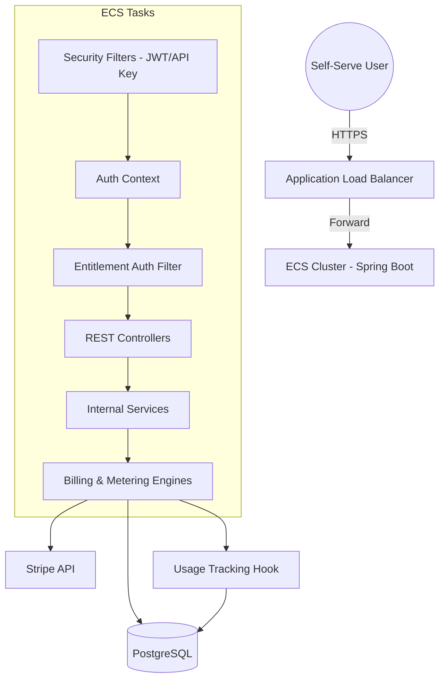
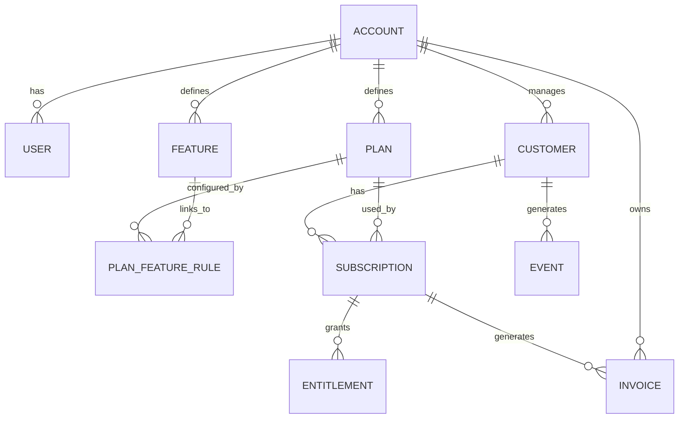

# Claude Context: Tanso Core - Comprehensive Technical Guide

This document is a deep-dive technical reference for the Tanso Core project. It is designed to provide maximum context for AI assistants, ensuring a clear understanding of the architecture, monetization engine, and "dogfooding" implementation.

---

## 1. Project Mission & Core Responsibilities
Tanso Core is a B2B SaaS monetization engine that powers the "Tanso" ecosystem. Its primary goal is to provide a robust, scalable, and flexible infrastructure for managing customer lifecycles, complex billing models, and real-time feature entitlements.

### Core Domains:
1.  **Identity & Workspace**: Management of `Accounts` (Tenants), `Users`, and their associations.
2.  **Product Catalog**: Defining `Features` and grouping them into `Plans`.
3.  **Monetization Rules**: Linking features to plans with complex logic (Flat, Usage-based, Graduated).
4.  **Subscription Management**: Orchestrating the lifecycle of a `Customer` on a `Plan`.
5.  **Usage & Metering**: High-throughput `Event` ingestion and real-time usage tracking.
6.  **Entitlements**: Dynamic, low-latency gating of capabilities based on subscription state.
7.  **Billing & Payments**: Invoice generation, cycle management, and Stripe synchronization.

---

## 2. Component Architecture & Client Interfaces

Tanso is a Spring Boot application deployed on AWS ECS behind an Application Load Balancer (ALB).

### A. High-Level Component Diagram (Mermaid)

```mermaid
graph TD
    User((Self-Serve User)) -->|HTTPS| ALB[Application Load Balancer]
    ALB -->|Forward| ECS[ECS Cluster - Spring Boot]
    
    subgraph ECS Tasks
        Security[Security Filters - JWT/API Key] --> Auth[Auth Context]
        Auth --> Gating[Entitlement Auth Filter]
        Gating --> Controllers[REST Controllers]
        Controllers --> Services[Internal Services]
        Services --> Engines[Billing & Metering Engines]
    end
    
    Engines --> DB[(PostgreSQL)]
    Engines --> Stripe[Stripe API]
    Engines --> Tracker[Usage Tracking Hook]
    Tracker --> DB
```

### B. Client API (`/api/v1/client/**`)
Designed for external integration and developer experience.
*   **Authentication**: Supports `Authorization: Bearer <API_KEY>` or `X-API-Key: <API_KEY>`.
*   **Key Endpoints**:
    *   `POST /events`: Ingest usage data (idempotent via `eventIdempotencyKey`).
    *   `GET /entitlements/{refId}/{key}`: Low-latency check for feature access.
    *   `POST /subscriptions`: Self-serve plan enrollment.

### C. Tanso Admin & UI API (`/api/v1/monetization/**`)
Powers the bundled admin console (`ui/`, Next.js + shadcn/ui) for managing the platform.
*   **Authentication**: Requires JWT with `ROLE_TANSO_UI`.
*   **Key Endpoints**:
    *   `GET /plans/features`: View the complete product catalog.
    *   `PATCH /rules/plan-features/diff/{id}`: Batch update feature rules for a plan.

### D. Security & Role Model

| Role | Access Pattern | Target Endpoints |
| :--- | :--- | :--- |
| **`ROLE_TANSO_UI`** | Tanso Dashboard Admins | `/api/v1/monetization/**`, `/api/v1/tanso/**` |
| **`ROLE_CLIENT`** | External Developers / API | `/api/v1/client/**` |
| **Public** | Login, Stripe webhooks | `/public/**` |

*   **JWT**: Short-lived tokens for UI sessions. Generated via `JwtService`.
*   **API Key**: Long-lived keys (`sk_live_...`/`sk_test_...`) for server-to-server integration. Handled by `ApiKeyAuthFilter`. Stored as SHA-256 digests (`key_value`) with a display hint (`key_hint`); legacy plaintext rows are upgraded in place on their first successful authentication. Rotation returns the plaintext exactly once.

### E. Configuration & Environment Flags

| Property | Default | Description |
| :--- | :--- | :--- |
| `app.dogfooding-enabled` | `true` | When `false`, skips Tanso Platform entitlement checks and usage tracking. Useful for local dev. |
| `app.telemetry.enabled` | `true` | Anonymous daily instance ping (`TANSO_TELEMETRY_ENABLED=false` to opt out). Entire surface is one class, `TelemetryPingJob`; payload is documented verbatim in the README (random `instance_id` UUID, version, entity counts, coarse event-volume bucket — no PII, no financial data, no keys). |
| `app.telemetry.endpoint` | `https://jozfgvokhefrdlojzefq.supabase.co/functions/v1/ping` | Where the ping posts — Supabase edge function `ping` (project `tanso-telemetry`), inserts into `telemetry_pings`. Swap to `telemetry.tansohq.com` if/when DNS is set up. |

The full OpenAPI spec is committed at `openapi.json` (repo root) — regenerate after API-surface changes with `curl localhost:8080/v3/api-docs | python3 -m json.tool > openapi.json`. Runtime serves it at `/v3/api-docs` (swagger-ui at `/swagger-ui.html`). SDK stance: `@tansohq/sdk` (TypeScript) is the only published client; other languages generate from the spec — don't add hand-written SDKs unasked.

---

## 3. Internal "Dogfooding" Architecture

Tanso bills itself using its own core logic. This "Double-Account" pattern is the most critical concept for understanding the platform's self-serve implementation.

### A. The "Double-Account" Mechanism
Tanso operates as a **Provider** to its own **Client Organizations**.
*   **Master Account**: A hardcoded entity (UUID: `00000000-0000-0000-0000-000000000000`) named "Tanso Platform".
*   **Client Organizations**: Every account provisioned by the operator (seed scripts) is registered as a `Customer` of the Master Account.
*   **Logical Mapping**: 
    *   `MasterAccount.id` -> The Provider.
    *   `ClientAccount.id` -> Stored as `Customer.externalClientCustomerId` under the Master Account.

### B. Dogfooding Logic Flows

#### 1. Account Provisioning (no signup endpoint)
There is deliberately **no public signup endpoint** in the OSS build — the
operator of a self-hosted billing engine *is* the tenant, and a public signup
route would be pure attack surface. Accounts are provisioned via
`scripts/create-test-account.sql` / `scripts/tenant-template.sql` (see
`deploy/setup.sh`), which create the account, admin user, settings, and API
key (stored as a digest, or auto-upgraded from plaintext on first use).

#### 2. Real-time Feature Gating
Handled by `EntitlementAuthFilter`:
1.  Intercepts `/api/v1/**` (Dashboard) requests.
2.  Extracts `accountId` from JWT.
3.  Calls `ClientEntitlementService.checkEntitlement` against the **Master Account**.
4.  If `isAllowed: true`, the request proceeds. Otherwise, returns `403 Forbidden`.

#### 3. Usage Metering Hook
Inside `EventServiceImpl.createEvent`:
1.  Processes the client's event.
2.  Check: `if (accountId != MasterAccount && eventType != ENTITLEMENT_CHECKED)`.
3.  **Recursion Prevention**: Ensures we don't meter the Master Account or the metering events themselves.
4.  Track: Calls `checkAndTrackEntitlement` for the Master Account, recording the client's platform usage.

### C. Why it exists:
1.  **Uniformity**: We use the same `/api/v1/client/**` APIs that our customers use.
2.  **Feedback Loop**: Any performance issue or bug in our billing affects us first.
3.  **Isolation**: Master revenue data is logically partitioned from client business data via the `accountId` foreign key.

---

## 4. Entity Relationship Deep Dive

### A. Core Hierarchy

```mermaid
erDiagram
    ACCOUNT ||--o{ USER : "has"
    ACCOUNT ||--o{ CUSTOMER : "manages"
    ACCOUNT ||--o{ PLAN : "defines"
    ACCOUNT ||--o{ FEATURE : "defines"
    PLAN ||--o{ PLAN_FEATURE_RULE : "configured_by"
    FEATURE ||--o{ PLAN_FEATURE_RULE : "links_to"
    CUSTOMER ||--o{ SUBSCRIPTION : "has"
    PLAN ||--o{ SUBSCRIPTION : "used_by"
    SUBSCRIPTION ||--o{ ENTITLEMENT : "grants"
    CUSTOMER ||--o{ EVENT : "generates"
    SUBSCRIPTION ||--o{ INVOICE : "generates"
    ACCOUNT ||--o{ INVOICE : "owns"
```

### B. Monetization Details
1.  **Feature**: A single capability (e.g., `feature_api_access`). Feature keys are globally unique per account.
2.  **Plan**: A product bundle (e.g., `Pro Tier`). Contains metadata like `priceAmount`, `intervalMonths`, and `billingTiming` (IN_ADVANCE vs IN_ARREARS).
3.  **PlanFeatureRule**: The "Glue" that defines how a feature behaves in a plan.
    *   `value` (JSONB): Contains the `PricingModel` and `CostModel`.
    *   `PricingModel`: Defines how we bill the customer (e.g., `usage` for flat rate, `graduated` for tiers).
    *   `CostModel`: Defines our internal cost for providing the feature (e.g., `simple` per-unit cost).

### C. Billing & Usage
1.  **Subscription**: Links a `Customer` to a `Plan`. Manages `current_period_start/end`, `billing_anchor_day`, and `cancel_mode`.
2.  **Entitlement**: The materialized "right to use" a feature for a specific subscription. These are transient records that the `EntitlementService` manages based on active subscriptions.
3.  **Event**: A record of activity. 
    *   `CLIENT_TRACKED`: Standard usage event (e.g., "AI Message Sent").
    *   `ENTITLEMENT_CHECKED`: Metadata event recorded for billing audit trails.
4.  **Invoice**: Generated at cycle end. Orchestrates payment via Stripe. Statuses: `PENDING`, `DUE`, `PAID`, `VOID`.
5.  **CreditFeatureWeight**: Append-only, effective-dated tariff mapping usage units to credits, resolved `(feature, model)` → `(feature, NULL)` → identity 1.0. Managed by `CreditWeightService` (batch publish, one shared future `effectiveFrom`, advisory-locked; future-only delete). Entitlement evaluate returns a `creditQuote`; ingestion applies the same resolution at the event's clamped `occurredAt` and reports `creditsDeducted`/`weightApplied`/`weightMatch`/`remainingBalance`. Console editor: Credits → Weights.
6.  **CreditPrice**: Append-only, effective-dated price book mapping a credit denomination to a buyer price (`pricePerCredit` + ISO currency) — the second pricing dial alongside the weight tariff. Managed by `CreditPriceService` with the same mechanics as weights (batch publish, one shared future `effectiveFrom`, advisory-locked; future-only delete); no default — an unpriced denomination resolves to empty. `PURCHASED` grants without an explicit `unitPrice` are stamped with the book price at grant time; an explicit `unitPrice` (negotiated top-up) always wins. Console editor: Credits → Pricing.

---

## 5. Critical Logic Flows

### A. Billing Cycle Rollover
Managed by `SubscriptionCycleJob` and `InvoiceService`:
1.  Identifies subscriptions where `currentPeriodEnd <= now`.
2.  Aggregates usage events for the period.
3.  Applies `RuleCalculationUtil` to determine costs based on `GraduatedPricingModel`.
4.  Creates a `DUE` invoice.
5.  Syncs with Stripe via `StripeSyncService`.

---

## 6. Service & Utility Deep Dive

### A. `RuleCalculationUtil`
This utility is the heart of the pricing engine. It deserializes the `PlanFeatureRule.value` into concrete models:
*   **Pricing**: Supports `SimpleUsageModel` (flat) and `GraduatedPricingModel` (tiered).
*   **Cost**: Supports `SimpleCostModel` for internal margin analysis.
*   **Logic**: `calculateActualCost` uses these models to turn raw usage units into currency amounts.

### B. `SubscriptionServiceImpl`
Manages state transitions:
*   `subscribe`: Initializes periods, generates the first invoice, and triggers entitlement granting.
*   `upgradeSubscription`: Handles immediate upgrades with proration calculation based on time remaining in the current period.
*   `cancelSubscription`: Supports `IMMEDIATE` (kill now) or `END_OF_PERIOD` (keep active until next cycle).

### C. `InvoiceServiceImpl`
Handles complex aggregation:
*   `calculateUsageItems`: Queries the `EventService` for all events belonging to a customer/feature within the billing window.
*   `processPendingInvoices`: Moves invoices from `PENDING` to `DUE` and triggers Stripe synchronization.

---

## 7. Development Guidelines for AI

### 1. Data Isolation is Paramount
Every query must be scoped by `accountId`. Never trust a raw UUID from a request body without verifying ownership via the `UserContext`.

### 2. The "Recursion Guard"
When modifying `EventService` or `EntitlementService`, always verify that you aren't creating a loop. Metering events (`ENTITLEMENT_CHECKED`) must never trigger further metering.

### 3. Schema Management
Do not hardcode Tanso's own plans/features in migrations. They should be seeded only as the Master Account (`2026.02.03.1.yaml`) and then managed through the platform's own UI to maintain flexibility.

### 4. Stripe Consistency
Always ensure that `Invoice` status changes in Tanso are reflected in Stripe (and vice-versa via webhooks). Use `StripeSyncService` as the primary bridge.

### 5. API Evolution
When adding endpoints to `client/` controllers, check if a corresponding `tanso/` (Admin) endpoint is needed. Clients should see "My Stuff," while Admins see "All Stuff for this Tenant."

### 6. Graceful Degradation
Entitlement checks should fail **closed** (deny access) if the database is unreachable or the Master Account configuration is missing.

### 7. Code Style & Standards
*   **MapStruct**: Use mappers for all Entity <-> DTO conversions.
*   **Liquibase**: All schema changes must be in a new YAML changelog file. Never modify existing changelogs.
*   **Lombok**: Extensively used for boilerplate reduction (`@Data`, `@RequiredArgsConstructor`).

---

## 8. Integration Architecture

### A. Stripe Synchronization
Tanso uses Stripe as the primary payment processor. The `StripeSyncService` acts as the bridge:
*   **Customer Sync**: Every Tanso `Customer` is mapped to a `StripeCustomer` via `createStripeCustomer`.
*   **Invoice Sync**: When an internal Tanso `Invoice` reaches the `DUE` state, it is pushed to Stripe via `syncNewInvoice`.
*   **Webhooks**: Stripe events (like `invoice.paid` or `subscription.deleted`) are ingested at `/public/stripe/ingest/webhook` and processed to update internal states.
*   **`StripeMode` (`AccountSetting.stripeMode`)**: `NONE`, `PAYMENT_PASS_THROUGH`, `STRIPE_INTEGRATION`, `STRIPE_DRIVEN`, plus `FULL_SYNC` (deprecated alias for `STRIPE_INTEGRATION`, changelog `2026.03.26.1`). The console (`Settings` page) only ever offers a **binary choice, gated on having a key connected** — matching the original product's setup wizard: before a key is connected, mode is locked to `NONE`; once connected, the operator picks "Stripe drives billing" (`STRIPE_INTEGRATION`) or "Tanso handles billing" (`PAYMENT_PASS_THROUGH`). `FULL_SYNC` and `STRIPE_DRIVEN` are real, working modes but were never user-facing choices in the wizard — they're reachable via the API/MCP tools (`StripeSetupTools`) only. If an account is already on one of them, the console shows it as the current value (doesn't silently overwrite it) but still won't offer it as a pick.
*   **Usage-priced plans in `STRIPE_INTEGRATION`** (fixed 2026-08-05): `createStripeProductWithPrices` used to create only the metered price — dropping the plan's flat base fee from Stripe — and checkout set a quantity on it, which Stripe rejects for metered prices, 500'ing every subscribe. Both prices are now created and checkout sets quantity only on licensed prices. Subscribing a paid plan in this mode returns a Checkout URL; the Tanso subscription is created by the `customer.subscription.created` webhook after payment.
*   **Disconnecting Stripe** (`StripeServiceImpl.deleteStripeKeys`) deletes the stored API key and webhook secret **and** resets `stripeMode` back to `NONE`. Before 2026-08-04 it only deleted the keys, leaving the account's mode pointed at a Stripe integration with no working key — any code path gating on `stripeMode`/`isStripeIntegration()` would still try to call Stripe and fail. This was a pre-existing bug in the original tansoflow codebase too, not something introduced by the OSS port. The `useDeleteStripeKeys` mutation (`ui/features/settings/mutations.ts`) invalidates both the `stripe-keys` and `settings` queries on success, since disconnect now touches both.

### B. Event Ingestion Pipeline
The `EventService` is designed for high throughput:
1.  **Idempotency**: Clients provide an `eventIdempotencyKey`. Tanso checks for duplicates before processing.
2.  **Mapping**: If `customerId` is missing, the service resolves it using `customerReferenceId` (the client's internal ID).
3.  **Real-time Tracking**: The `trackTansoPlatformUsage` hook ensures that every business event ingested is also recorded as a monetization event for Tanso itself.

---

## 9. Troubleshooting Guide
*   **"Missing Entitlement"**: Check if the client's `accountId` exists as a `Customer` under the Master Account and has a `Subscription` to a plan that includes the feature key.
*   **"Stripe Out of Sync"**: Verify the `StripeInvoice` record exists and check the logs for webhook delivery failures.
*   **"Duplicate Event"**: Ensure the `eventIdempotencyKey` provided by the client is truly unique. Check `event_idempotency_key_idx` in Postgres.
*   **"Cannot subscribe to plan: status is DRAFT"**: New plans are created as `DRAFT` and cannot accept subscriptions. Attach features first, then edit the plan to `ACTIVE` — activation also requires a non-empty `description`, enforced server-side.
*   **404 on `GET /entitlements/{refId}/{key}`**: `refId` is the customer's `externalClientCustomerId` (Reference ID), not the internal customer UUID. Events can be ingested by internal `customerId`, but entitlement checks require the customer to have been created with a Reference ID.
*   **New paid subscription shows `isActive: false`**: Expected. A subscription only flips to active once its first invoice is marked paid (`markInvoiceAsPaid` in `SubscriptionServiceImpl`). Free ($0) plans activate immediately since there's nothing to collect.
*   **Webhooks never arrive on localhost**: Stripe can't reach the registered endpoint. Run `stripe listen --forward-to http://localhost:8080/public/stripe/ingest/webhook/{accountId}`, then overwrite the stored `WEBHOOK_SECRET_SIGNING` row in `external_api_keys` with the CLI's printed `whsec_…` — signature verification uses the stored secret, not the CLI's.
*   **Console: "Attach feature" / "New subscription" panel — Base UI Select fields**: clicking a `Select` trigger and immediately typing inserts characters into the trigger's placeholder text without registering a selection, so the form submits with an empty value. Click the trigger, wait for the popover, then click an option from the list.

## 10. Agent-Serve Surface (2026-08-06)

The engine makes an operator's product agent-ready for their END CUSTOMERS' agents (six areas of the agent-serve audit). Key mechanics:

*   **Customer-scoped keys**: `ck_live_`/`ck_test_` rows in `account_api_keys` with `customer_id` + `scopes` (`read`,`purchase`). `ApiKeyAuthFilter` grants `ROLE_CUSTOMER` + `SCOPE_*`; principal `UserContext(accountId, customerId, customerReferenceId, scopes, null)`. **Deny-by-default**: class-level `@PreAuthorize('CLIENT')` rejects customer keys everywhere; opened endpoints use method-level `hasAnyRole('CLIENT','CUSTOMER')` + one `CustomerAccessGuard.resolveCustomerRef(...)` line (pins ck_ callers to their own ref; `requirePurchaseScope` where money moves). Tenant key rotation (`rotateApiKey`) deactivates only `customer IS NULL` rows; customer keys are managed per-key via `/api/v1/client/customers/{ref}/keys`.
*   **Public discovery**: `GET /public/v1/catalog/{slug}/pricing.json` (agent-serve schema, schema-validated in tests). Served only when `accounts.slug` set AND `account_settings.public_catalog_enabled`; unknown slug and disabled catalog are the same 404.
*   **Agent signup**: `POST /public/v1/catalog/{slug}/signup` → Customer (`agent_<uuid>` reference) + free default plan subscription + ck_ key (read,purchase), once per settings opt-in; hourly cap → 429 + Retry-After. Default plan validated free+ACTIVE at settings-save.
*   **Purchasing**: SetupIntent (`POST .../payment-methods/setup-intent`, confirm client-side, `.../payment-methods/default` or `setup_intent.succeeded` webhook stores `customers.stripe_default_payment_method_id`). Paid subscribe with pm → `StripeSyncService.createDirectSubscription` (off_session, ERROR_IF_INCOMPLETE) + synchronous Tanso subscription via `StripeWebhook.materializeStripeSubscription` (deduped by unique `stripe_subscription_external_id`). No pm → checkout URL + `checkout_sessions` row; customer-key callers get **402**; poll `GET /api/v1/client/checkout-sessions/{id}`. Credit top-up: `POST /api/v1/client/credits/purchases` prices from the book, grants PURCHASED idempotently by payment intent id, 402 fallback, spend cap (`account_settings.agent_max_topup_amount`) enforced in `StripePaymentMethodServiceImpl` before money moves.
*   **Per-key budgets**: a budget on the `account_api_keys` row bounds one actor — `budget_credits` and `budget_amount` are capped independently over `budget_period` (DAY/WEEK/MONTH/TOTAL), windows tiling forward from `budget_started_at`. `api_key_spend_records` is the ledger both checks sum over (CREDITS rows from event ingestion, MONEY rows from top-ups); `checkout_sessions.api_key_id`/`.amount` carry the key through hosted checkout, since the completing webhook has no security context. Enforced by `KeyBudgetService.assertWithinBudget` in three places: `EventServiceImpl` (credits, beside the pool hard-limit guard), `StripePaymentMethodServiceImpl.enforceSpendCap` (top-up money, alongside the per-transaction account cap), and `SubscriptionServiceImpl.subscribe` (paid-plan money, before either Stripe path). That third one was added 2026-08-21 after QA found a $0-budget key could still be handed a Checkout URL for a $9/mo plan — `enforceSpendCap` only ever covered top-ups, so both subscribe paths walked past it. Note `agent_max_topup_amount` still does not cover subscribe; only the per-key budget does. Hosted checkout is recorded by `StripeWebhookImpl.handleSessionsComplete` reading `checkout_sessions.api_key_id`/`.amount`, idempotent on `checkout_<sessionId>`; the webhook has no security context, which is why those columns exist. Breach → 403 + `error.code: "budget_exceeded"`. Managed at `PUT/GET/DELETE /api/v1/client/customers/{ref}/keys/{keyId}/budget` (and the console mirror `/api/v1/tanso/customers/{customerId}/keys/**`, added 2026-08-21 — the client chain only authenticates API keys, so a console JWT could never reach the client endpoints and the operator had no UI at all) — **PUT is CLIENT-only**, a customer key must not raise its own ceiling; GET is open to the owning ck_ key so an agent can pre-flight. MCP: `AgentCustomerTools.getMyBudget`. Console: an API keys card on the customer detail page issues/rotates/revokes keys and sets budgets; `CustomerApiKeyDto` carries a budget summary so the list shows caps without a round trip per key. Rotation does not carry the budget forward — the replacement key starts unbudgeted.
*   **Usage forecast**: `GET /api/v1/client/customers/{ref}/usage` — per-feature linear projection (null under 5% elapsed), per-pool average burn + depletion date + book price.
*   **Dev readiness**: stable `error.code` in every envelope (ErrorCode enum; filters/entry points share `SecurityErrorWriter`); `Idempotency-Key` header replay (24h, `idempotency_records`, conflicts → 409 `idempotency_conflict`); CORS exposes `Idempotency-Key`/`X-Request-ID`/`Retry-After`.
*   **MCP**: `Admin*Tools` + `StripeSetupTools` require `app.mcp.admin-tools.enabled` (default false) on top of `app.mcp.enabled`; `McpToolGuard.requireAdminAccountId()` fails closed in every admin tool. `AgentCustomerTools` is the curated customer surface (listPlans, getCreditPrices, checkEntitlement, getUsageForecast, subscribePlan, purchaseCredits — spend tools need `confirmAction`).
*   Deliberately deferred: rate limiting/headers, outbound webhooks, Web Bot Auth, A2A card, x402, console settings UI for the new account settings (needs an OpenAPI schema regen for ui/).

---
*Last Updated: 2026-08-21*
